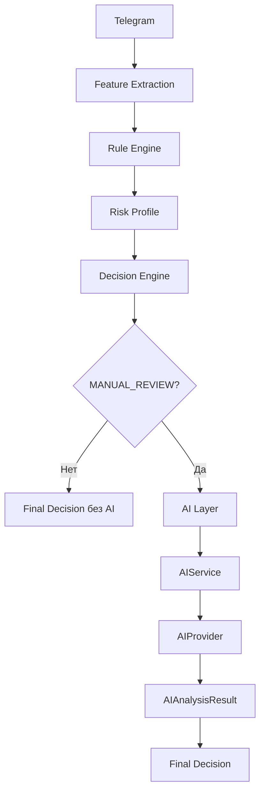

# BotHunter AI — AI Layer

## Обзор

AI Layer (v0.9) — независимый модуль для AI-анализа профиля риска.

**Важно:** AI не является основной системой принятия решений. AI вызывается **только** для заявок со статусом `MANUAL_REVIEW`.

OpenAI используется через Structured Output (строгий JSON). При недоступности API применяется fallback на `MockAIProvider`.

---

## Архитектура



---

## Компоненты

| Компонент | Назначение |
|-----------|------------|
| `AIProvider` | Интерфейс провайдера AI |
| `MockAIProvider` | Детерминированный провайдер для тестов и fallback |
| `OpenAIProvider` | OpenAI SDK + Structured Output |
| `PromptBuilder` | Формирование prompt без персональных данных |
| `AIService` | Оркестрация: retry, timeout, fallback, logging |
| `AIAnalysisResult` | Структурированный результат анализа |

---

## AIProvider

```python
from app.ai import AIProvider, AIAnalysisResult
from app.risk import RiskProfile

class AIProvider(ABC):
    def analyze(self, risk_profile: RiskProfile) -> AIAnalysisResult: ...
```

---

## AIService

```python
from app.ai import AIService, AIServiceStatus
from app.models.enums import AnalysisDecision

service = AIService()
result = service.analyze(decision, risk_profile)

if result.status == AIServiceStatus.SKIPPED:
    # APPROVED или REJECTED — AI не вызывался
    ...
elif result.status == AIServiceStatus.SUCCESS:
    analysis = result.analysis
elif result.status == AIServiceStatus.FALLBACK:
    # OpenAI недоступен, использован MockAIProvider
    analysis = result.analysis
elif result.status == AIServiceStatus.UNAVAILABLE:
    # AI полностью недоступен
    ...
```

### Логика вызова

| Decision | AI |
|----------|-----|
| `APPROVED` | не вызывается |
| `REJECTED` | не вызывается |
| `MANUAL_REVIEW` | вызывается |

### Надёжность

- **Retry:** до 2 попыток основного провайдера
- **Timeout:** `OPENAI_TIMEOUT` (по умолчанию 30 сек)
- **Fallback:** `MockAIProvider` при ошибке OpenAI
- **AI_UNAVAILABLE:** если fallback тоже не сработал

---

## AIAnalysisResult

| Поле | Тип | Описание |
|------|-----|----------|
| `ai_score` | int | 0–100 |
| `confidence` | float | 0.0–1.0 |
| `decision` | `AnalysisDecision` | APPROVED / MANUAL_REVIEW / REJECTED |
| `reason` | str | Краткое объяснение |
| `provider` | str | `openai` / `mock` |
| `response_time_ms` | int | Время ответа |
| `prompt_tokens` | int | Токены prompt |
| `completion_tokens` | int | Токены completion |
| `total_tokens` | int | Сумма токенов |
| `model` | str | Модель |
| `created_at` | datetime | UTC timestamp |

---

## PromptBuilder — минимизация данных

В prompt передаются **только**:

- Risk Level
- Confidence
- Signals
- Summary

**Не передаются:** username, first_name, last_name, telegram_id, chat_id.

### Пример Prompt

**System:**

```
You are a Telegram channel join-request risk analyst. Analyze the anonymized risk profile...
```

**User:**

```
Risk profile (no personal data):
- Risk level: MEDIUM
- Confidence: 0.71
- Signals: no_photo, many_digits, unknown_language
- Summary: Пользователь имеет следующие признаки риска: отсутствует фотография профиля, большое количество цифр в username и язык неизвестен.
```

---

## Structured Output (JSON)

OpenAI возвращает строго типизированный JSON:

```json
{
  "ai_score": 52,
  "confidence": 0.71,
  "decision": "ManualReview",
  "reason": "Multiple moderate risk signals detected in anonymized profile."
}
```

Схема: `StructuredAnalysisOutput` (`app/ai/schemas.py`).

Допустимые значения `decision`: `Approved`, `ManualReview`, `Rejected`.

---

## MockAIProvider

Детерминированное поведение по `risk_level`:

| Risk Level | ai_score (base) | decision |
|------------|-----------------|----------|
| LOW | ~12 | APPROVED |
| MEDIUM | ~52 | MANUAL_REVIEW |
| HIGH | ~88 | REJECTED |

Корректируется количеством signals (+4 за signal, max +20).

---

## Конфигурация (.env)

```env
OPENAI_API_KEY=sk-...
OPENAI_MODEL=gpt-4o-mini
OPENAI_TIMEOUT=30
```

---

## Логирование

`AIService` логирует:

- provider, model
- response_time_ms
- prompt_tokens, completion_tokens, total_tokens
- estimated_cost_usd
- ошибки и fallback

---

## Независимость модуля

AI Layer интегрирован в `JoinRequestProcessingService` для заявок со статусом `MANUAL_REVIEW`.

Rule Engine, Feature Extraction, Repository Layer и Decision Engine не изменялись на уровне публичного API — интеграция выполнена через orchestrator.
