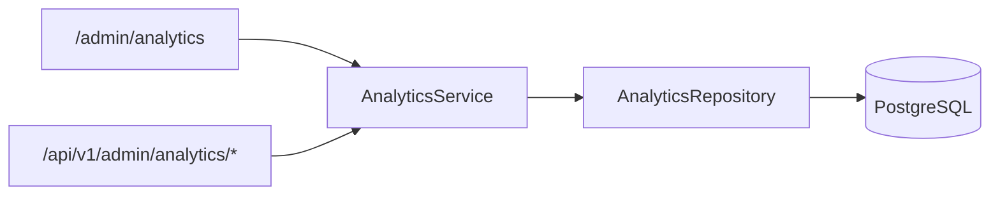

# BotHunter AI — AI Analytics & Feedback Center (v1.7)

## Overview

v1.7 adds read-only analytics over existing data:

- `ai_feedbacks` — human vs AI decisions
- `ai_analyses` — AI/rule decisions and explanations
- `ai_usage` — provider/model cost and latency

No changes to Join Request pipeline, Rule Engine, Reputation Engine, or AI Gateway.

---

## Architecture



All SQL aggregation lives in `AnalyticsRepository`. Routers contain no SQL.

Optional future layer: Redis cache for heavy queries (not implemented in v1.7).

---

## Web UI

| URL | Description |
|-----|-------------|
| `/admin/analytics` | AI Analytics & Feedback Center |
| `/admin/analytics?days=7\|30\|90` | Timeline period selector |
| `/admin/ai` | Extended AI Usage dashboard |
| `/admin/join-request/{id}` | Decision Inspector (AI vs Human) |

### Blocks on `/admin/analytics`

1. **AI Accuracy** — total, matched, mismatched, accuracy %, false approve/reject, manual review accuracy
2. **Decision Distribution** — Approved / Rejected / Manual Review bars
3. **AI Provider Statistics** — provider, model, requests, latency, tokens, cost, confidence, accuracy
4. **Rule Effectiveness** — triggered count, avg score, AI/admin agreement, false positives
5. **Human Feedback Categories** — approve/reject after AI decisions
6. **AI Quality Timeline** — daily accuracy, cost, latency, confidence
7. **Recent Feedback** — last 50 cases with links to join requests

### Decision Inspector

On join request detail, when admin changed AI decision (`ai_feedbacks` exists):

```
AI: Manual Review ↓ Admin: Approved
[AI ошибся]
```

If decisions match: **AI подтвердился**.

---

## REST API (read-only)

| Method | Path | Description |
|--------|------|-------------|
| GET | `/api/v1/admin/analytics` | Full overview |
| GET | `/api/v1/admin/analytics/accuracy` | AI accuracy metrics |
| GET | `/api/v1/admin/analytics/rules` | Rule effectiveness |
| GET | `/api/v1/admin/analytics/providers` | Provider/model stats |
| GET | `/api/v1/admin/analytics/timeline?days=30` | Timeline (7/30/90) |

---

## Metric Definitions

### AI Accuracy

Based on `ai_feedbacks.was_ai_correct`:

- **False Approve** — AI `Approved`, human did not approve
- **False Reject** — AI `Rejected`, human did not reject
- **Manual Review Accuracy** — share of manual-review cases where human agreed with AI stance

### Rule Effectiveness

Parsed from `ai_analyses.explanation.triggered_rules`:

- **AI agreed** — rule triggered and AI decision ≠ Approved
- **Admin agreed** — rule triggered and human rejected
- **False positive** — rule triggered, AI cautious, human approved

### Provider Accuracy

Join `ai_analyses` + `ai_feedbacks` on `join_request_id`, provider/model from `explanation.ai_result`.

---

## Files

| Path | Role |
|------|------|
| `app/repositories/analytics.py` | Aggregating SQL |
| `app/services/analytics.py` | DTO mapping |
| `app/schemas/analytics.py` | DTOs + API schemas |
| `app/api/v1/analytics.py` | REST endpoints |
| `app/admin/templates/dashboard/analytics.html` | Analytics UI |

---

## Testing

```bash
pytest tests/analytics/ -q
```

Coverage: accuracy, rules, providers, timeline, REST API, dashboard page, decision comparison.
