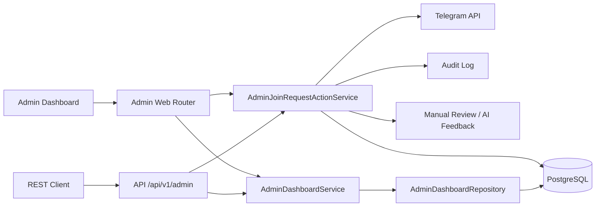

# BotHunter AI — Admin Dashboard

## Обзор

Web Admin Dashboard позволяет просматривать и обрабатывать заявки на вступление в браузере.

Стек: **FastAPI + Jinja2 + HTMX + Bootstrap 5**.

OpenAI **не используется** в dashboard.

**v1.4:** OpenRouter AI Gateway — `/admin/ai`, `/admin/settings/ai`, ai_usage tracking.

**v1.3:** Reputation Engine — Trust Score, auto approve/reject, Reputation History, REST API reputation.

**v1.2:** интерактивные действия администратора (Approve/Reject/Whitelist/Blacklist) + feedback loop.

---

## Архитектура



---

## Web UI

| URL | Описание |
|-----|----------|
| `/admin` | Список заявок, статистика, фильтры, поиск, пагинация (25) |
| `/admin/join-request/{id}` | Детальная карточка + действия |
| `/admin/partials/join-requests` | HTMX partial для таблицы |

### Действия на странице заявки

| Кнопка | Поведение |
|--------|-----------|
| Approve | Telegram approve + status Approved + audit + feedback |
| Reject | Telegram decline + status Rejected + audit + feedback |
| Add to Whitelist | Whitelist + auto-approve active заявки |
| Add to Blacklist | Blacklist + auto-reject active заявки |

Кнопки **disabled** для финальных статусов (Approved/Rejected).

Flash-сообщения показываются после redirect.

### Trust Score (v1.3)

| Место | Отображение |
|-------|-------------|
| Главная | Колонка **Trust**, карточка **Avg Trust** |
| Detail | Карточка **Trust Score** (N / 100), секция Risk Profile |
| Reputation History | Таблица: дата, old/new score, причина, администратор |

Цвета бейджа:

| Диапазон | Цвет |
|----------|------|
| 80–100 | зелёный (`success`) |
| 40–79 | жёлтый (`warning`) |
| 0–39 | красный (`danger`) |

### Бейджи на главной

- **Whitelisted** — пользователь в whitelist
- **Blacklisted** — пользователь в blacklist

| `/admin/settings/ai` | Read-only AI конфигурация (provider, model, timeout, retry) |

### AI Usage (v1.4)

| URL | Описание |
|-----|----------|
| `/admin/ai` | AI-статистика: запросы, токены, cost, latency, top models, daily |

---

## REST API

| Method | URL | Описание |
|--------|-----|----------|
| GET | `/api/v1/admin/join-requests` | Список заявок |
| GET | `/api/v1/admin/join-requests/{id}` | Детали заявки |
| GET | `/api/v1/admin/statistics` | Статистика (+ avg_trust_score) |
| GET | `/api/v1/admin/reputation/{telegram_user_id}` | Trust score, history, trend |
| POST | `/api/v1/admin/join-requests/{id}/approve` | Одобрить |
| POST | `/api/v1/admin/join-requests/{id}/reject` | Отклонить |
| POST | `/api/v1/admin/join-requests/{id}/whitelist` | Whitelist |
| POST | `/api/v1/admin/join-requests/{id}/blacklist` | Blacklist |

---

## Сервисный слой

| Сервис | Назначение |
|--------|------------|
| `AdminDashboardService` | Read-only: список, detail, statistics, reputation |
| `AdminJoinRequestActionService` | Approve/Reject/Whitelist/Blacklist |

---

## Feedback Loop (v1.2)

| Таблица | Назначение |
|---------|------------|
| `manual_reviews` | История ручных действий администратора |
| `ai_feedbacks` | Сравнение AI decision vs human decision |
| `audit_logs` | Audit trail всех admin actions |

---

## Запуск

```bash
docker compose -f docker/docker-compose.yml up -d
docker exec bothunter-api alembic upgrade head
```

Открыть: http://localhost:8000/admin

---

## Тесты

```bash
python -m pytest tests/admin/ tests/reputation/ tests/services/test_join_request_list_match.py -v
```
