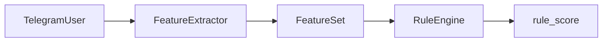

# BotHunter AI — Feature Extraction

## Обзор

v0.7 выделяет извлечение признаков в отдельный модуль `app/features/`.

```
TelegramUser  →  FeatureExtractor.extract()  →  FeatureSet  →  RuleEngine
```

Rule Engine **не анализирует** `TelegramUser` напрямую — только `FeatureSet`.

---

## Архитектура



---

## FeatureExtractor

```python
from app.features import FeatureExtractor
from app.models.telegram_user import TelegramUser

extractor = FeatureExtractor()
features = extractor.extract(telegram_user)
```

---

## FeatureSet

### Profile

| Признак | Тип | Описание |
|---------|-----|----------|
| `has_photo` | bool | Есть фото профиля |
| `has_username` | bool | Username задан |
| `is_premium` | bool | Telegram Premium |
| `language` | str \| None | Код языка |

### Username

| Признак | Тип | Описание |
|---------|-----|----------|
| `username_length` | int | Длина username |
| `digit_count` | int | Количество цифр |
| `consecutive_digits` | int | Макс. подряд идущих цифр |
| `contains_dictionary_words` | bool | Содержит словарные слова |
| `contains_crypto_words` | bool | Содержит crypto/bonus/airdrop и т.д. |
| `contains_random_sequence` | bool | Похож на случайную последовательность |
| `entropy` | float | Энтропия Шеннона |

### Name

| Признак | Тип | Описание |
|---------|-----|----------|
| `full_name_length` | int | Длина полного имени |
| `emoji_count` | int | Количество emoji |
| `uppercase_ratio` | float | Доля заглавных букв |
| `latin_ratio` | float | Доля латиницы среди букв |
| `cyrillic_ratio` | float | Доля кириллицы среди букв |
| `mixed_alphabet` | bool | Смешанная латиница и кириллица |
| `contains_suspicious_words` | bool | Подозрительные слова в имени (для Rule Engine) |

### System

| Признак | Тип | Описание |
|---------|-----|----------|
| `extraction_version` | str | Версия экстрактора |
| `extracted_at` | datetime | Время извлечения (UTC) |

---

## Пример FeatureSet

```json
{
  "profile": {
    "has_photo": false,
    "has_username": true,
    "is_premium": false,
    "language": "ru"
  },
  "username": {
    "username_length": 14,
    "digit_count": 7,
    "consecutive_digits": 7,
    "contains_dictionary_words": false,
    "contains_crypto_words": true,
    "contains_random_sequence": false,
    "entropy": 3.2516
  },
  "name": {
    "full_name_length": 11,
    "emoji_count": 3,
    "uppercase_ratio": 0.25,
    "latin_ratio": 0.7273,
    "cyrillic_ratio": 0.0,
    "mixed_alphabet": false,
    "contains_suspicious_words": false
  },
  "system": {
    "extraction_version": "1.0.0",
    "extracted_at": "2026-06-29T14:50:00+00:00"
  }
}
```

---

## Структура каталога

```
backend/app/features/
├── __init__.py
├── feature_set.py
├── extractor.py
└── utils.py
```

---

## Тестирование

```bash
python -m pytest tests/features/ tests/rules/ -v
```

---

## Ограничения v0.7

- OpenAI **не используется**
- `DecisionEngine` **не изменён**
- Модель `JoinRequest` **не изменена**
