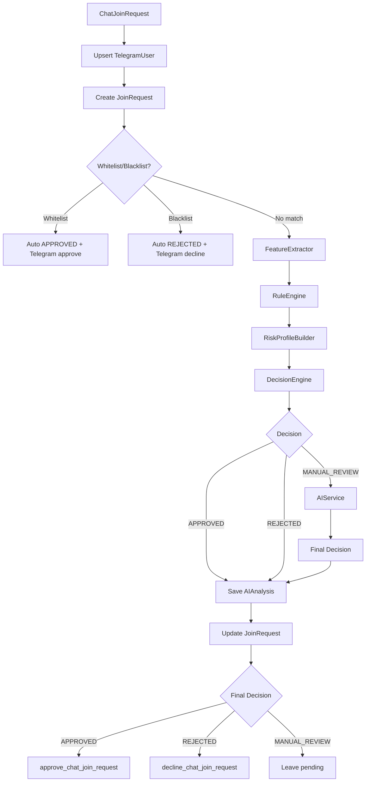

# BotHunter AI — Join Request Processing

## Обзор

Production-пайплайн обработки заявки на вступление (v1.0-beta).



---

## Обработчик

Файл: `app/bot/handlers/join_request.py`

- Событие: `ChatJoinRequest` (Aiogram 3)
- Router: `join_request_router`
- При ошибке: `rollback`, structured log, бот продолжает работу

---

## JoinRequestProcessingService

Файл: `app/services/join_request_processing.py`

| Шаг | Действие |
|-----|----------|
| 1 | Найти канал по `telegram_chat_id` |
| 2 | Создать/обновить `TelegramUser` |
| 3 | Создать `JoinRequest` |
| 3a | **v1.2:** проверить whitelist/blacklist → short-circuit без Rule Engine |
| 4 | `FeatureExtractor` → `FeatureSet` |
| 5 | `RuleEngine` → `rule_score` |
| 6 | `RiskProfileBuilder` → `RiskProfile` |
| 7 | `DecisionEngine` → initial decision |
| 8 | Если `MANUAL_REVIEW` → `AIService` |
| 9 | Финальное решение + `AIAnalysis` |
| 10 | Обновить `JoinRequest` |
| 11 | Approve / Decline / pending (ошибки Telegram не откатывают БД) |

---

## DecisionEngine

Файл: `app/services/decision_engine.py`

| rule_score | Решение |
|------------|---------|
| < approve_below | `APPROVED` (AI не вызывается) |
| approve_below – reject_from | `MANUAL_REVIEW` → AI |
| ≥ reject_from | `REJECTED` (AI не вызывается) |

### Конфигурация порогов

Единый источник: `get_decision_thresholds()` в `app/config/decision_settings.py`.

1. Базовые значения из `backend/config/decision_thresholds.yaml`
2. Переопределение через `.env`, если переменные заданы явно:

```env
DECISION_APPROVE_BELOW=30
DECISION_REJECT_FROM=70
```

`DecisionEngine` и `RiskProfileBuilder` используют одни и те же пороги.

---

## AI Layer в join flow

AI вызывается **только** при initial decision = `MANUAL_REVIEW`.

| AIService status | Final decision |
|------------------|----------------|
| `SKIPPED` | rule-based decision |
| `SUCCESS` / `FALLBACK` | `AIAnalysisResult.decision` |
| `AI_UNAVAILABLE` | `MANUAL_REVIEW` |

---

## AIAnalysis

| Поле | Без AI | С AI |
|------|--------|------|
| `rule_score` | rule engine score | rule engine score |
| `ai_score` | `NULL` | `AIAnalysisResult.ai_score` |
| `final_score` | `rule_score` | `(rule_score + ai_score) / 2` |
| `decision` | rule-based | final decision |
| `explanation` | JSON (см. ниже) | JSON (см. ниже) |

### Формат `explanation`

```json
{
  "triggered_rules": [{"rule": "NoPhotoRule", "score": 20}],
  "risk_profile": {"risk_level": "MEDIUM", "signals": ["no_photo"], "...": "..."},
  "ai_result": {"ai_score": 52, "decision": "ManualReview", "...": "..."},
  "ai_status": "SUCCESS"
}
```

---

## Логирование

```
Join request processed | Telegram ID: ... | Username: ... | Rule Score: ... | AI Score: ... | Final Score: ... | Decision: ... | AI Status: ... | Channel: ... | Action: ...
```

---

## Тестирование

```bash
python -m pytest tests/services/test_join_request_processing.py tests/services/test_join_request_e2e.py tests/bot/test_join_request_handler.py -v
```

