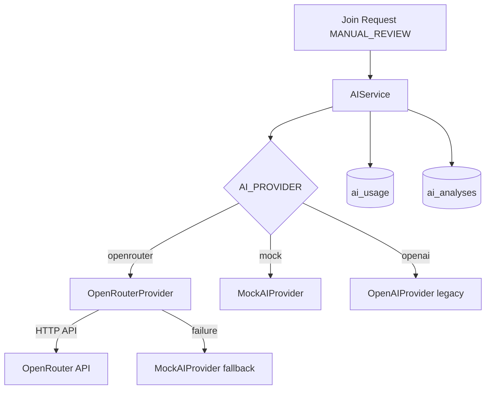

# BotHunter AI — OpenRouter Universal AI Gateway

**Версия:** v1.4

## Обзор

OpenRouter — универсальный AI Gateway для подключения любых LLM через HTTP API без использования OpenAI SDK.

Выбор провайдера выполняется через переменную окружения `AI_PROVIDER`.

---

## Конфигурация (.env)

```env
AI_PROVIDER=openrouter
OPENROUTER_API_KEY=your-key
OPENROUTER_BASE_URL=https://openrouter.ai/api/v1
OPENROUTER_MODEL=openai/gpt-4.1
AI_TIMEOUT=30
AI_MAX_RETRIES=2
```

### Переключение Mock ↔ OpenRouter

| Режим | Настройка |
|-------|-----------|
| Mock (по умолчанию) | `AI_PROVIDER=mock` |
| OpenRouter | `AI_PROVIDER=openrouter` + `OPENROUTER_API_KEY` |
| OpenAI (legacy) | `AI_PROVIDER=openai` + `OPENAI_API_KEY` |

Если `AI_PROVIDER=openrouter`, но ключ не задан — автоматически используется `MockAIProvider`.

---

## Поддерживаемые модели (только через .env)

Модель меняется без изменения кода:

| OPENROUTER_MODEL | Провайдер |
|------------------|-----------|
| `openai/gpt-4.1` | OpenAI |
| `anthropic/claude-sonnet-4` | Anthropic |
| `google/gemini-2.5-pro` | Google |
| `deepseek/deepseek-chat` | DeepSeek |
| `meta-llama/llama-3.3-70b-instruct` | Meta |

---

## Архитектура



---

## Компоненты

| Класс | Файл | Назначение |
|-------|------|------------|
| `OpenRouterProvider` | `app/ai/openrouter_provider.py` | HTTP-клиент OpenRouter (httpx) |
| `AIRouter` | `app/ai/router.py` | Выбор primary provider по конфигу |
| `AIService` | `app/ai/service.py` | Retry, timeout, fallback |
| `PromptBuilder` | `app/ai/prompt_builder.py` | Anonymized prompt |

---

## Structured Output

Ответ LLM — строгий JSON по схеме `StructuredAnalysisOutput`:

```json
{
  "risk_score": 48,
  "confidence": 0.72,
  "decision": "ManualReview",
  "reason": "...",
  "recommended_action": "ManualReview",
  "signals": ["no_photo"]
}
```

Поле `risk_score` маппится на внутренний `ai_score`.

---

## Prompt (без PII)

Передаётся:

- Risk level, Rule score, Trust score
- Confidence, Signals, Summary
- Reputation history (анонимизированная: `REASON: old -> new`)

Не передаётся:

- Telegram ID, Username, First/Last Name, Chat ID

---

## Retry & Fallback

| Параметр | Значение |
|----------|----------|
| Retry | 2 попытки (primary) |
| Timeout | 30 секунд |
| Fallback | MockAIProvider |
| Pipeline | не останавливается |

AI Status в Dashboard:

| Status | Отображение |
|--------|-------------|
| SUCCESS | Success |
| FALLBACK | Fallback |
| AI_UNAVAILABLE | Failed |

---

## Стоимость (ai_usage)

Таблица `ai_usage` — запись после каждого успешного AI-вызова (SUCCESS/FALLBACK):

| Поле | Описание |
|------|----------|
| provider | openrouter / mock |
| model | имя модели |
| prompt_tokens | input tokens |
| completion_tokens | output tokens |
| total_tokens | сумма |
| estimated_cost | USD (оценка по pricing table) |
| latency_ms | время ответа |
| created_at | timestamp |

Стоимость рассчитывается в `estimate_request_cost_usd()` по таблице цен моделей.

---

## Dashboard

| URL | Описание |
|-----|----------|
| `/admin/ai` | Статистика AI: запросы, токены, cost, latency, top models, daily |
| `/admin/settings/ai` | Read-only: provider, model, timeout, retry, fallback |

---

## Безопасность

- API Key **только** из `.env`
- Не хранится в БД
- Не логируется
- При отсутствии ключа → MockAIProvider
