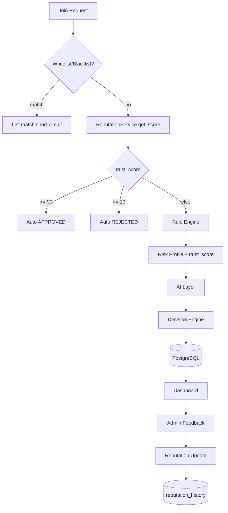

# BotHunter AI — Reputation & Learning Engine

**Версия:** v1.3

## Обзор

Reputation Engine накапливает доверие к Telegram-пользователям на основе решений администратора и использует `trust_score` для ускорения join pipeline.

OpenAI, Rule Engine, Feature Extraction и AI Layer **не изменяются**. В Risk Profile добавлено только поле `trust_score` для будущего использования AI.

---

## Trust Score

| Параметр | Значение |
|----------|----------|
| Диапазон | 0 … 100 |
| Начальное значение | 50 |
| Хранение | `reputations.reputation_score` |

### Изменения при действиях администратора

| Действие | Δ / значение | Причина в history |
|----------|--------------|-------------------|
| Approve | +5 | `MANUAL_APPROVED` |
| Reject | −10 | `MANUAL_REJECTED` |
| Whitelist | 100 | `WHITELISTED` |
| Blacklist | 0 | `BLACKLISTED` |

Автоматические решения pipeline (`APPROVED` / `REJECTED` из Rule Engine) могут использовать причины `APPROVED` / `REJECTED` при интеграции с feedback loop.

---

## Компоненты

```
backend/app/reputation/
  engine.py    — ReputationEngine (расчёт score, пороги auto approve/reject)
  service.py   — ReputationService (get_score, increase, decrease, set_whitelist, set_blacklist, recalculate)
  enums.py     — ReputationChangeReason, ReputationTrend
```

### Пороги auto-decision

| trust_score | Решение | Rule Engine | AI |
|-------------|---------|-------------|-----|
| ≥ 90 | APPROVED | пропуск | пропуск |
| ≤ 10 | REJECTED | пропуск | пропуск |
| иначе | обычный pipeline | да | по правилам |

---

## Таблица reputation_history

| Поле | Тип | Описание |
|------|-----|----------|
| id | UUID | PK |
| telegram_user_id | UUID | FK → telegram_users |
| old_score | float | Score до изменения |
| new_score | float | Score после изменения |
| reason | enum | APPROVED, REJECTED, WHITELISTED, BLACKLISTED, MANUAL_APPROVED, MANUAL_REJECTED |
| created_at | timestamptz | Время записи |
| actor | string | `system` или `admin_dashboard` |

---

## Trend

По последним 3 записям history:

| Условие | Trend |
|---------|-------|
| delta > 0.5 | UP |
| delta < −0.5 | DOWN |
| иначе | STABLE |

---

## REST API

```
GET /api/v1/admin/reputation/{telegram_user_id}
```

Ответ:

```json
{
  "current_score": 78.0,
  "history": [
    {
      "created_at": "2026-06-30T12:00:00Z",
      "old_score": 50.0,
      "new_score": 55.0,
      "reason": "MANUAL_APPROVED",
      "actor": "admin_dashboard"
    }
  ],
  "trend": "UP"
}
```

---

## Полный цикл (Mermaid)


