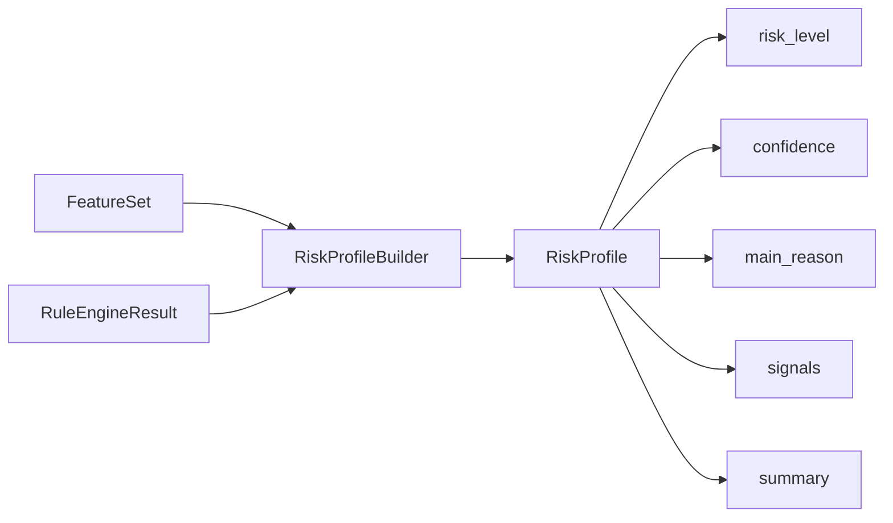

# BotHunter AI — Risk Profile

## Обзор

Risk Profile Engine (v0.8) преобразует `FeatureSet` и `RuleEngineResult` в структурированный профиль риска.

```
FeatureSet + RuleEngineResult  →  RiskProfileBuilder  →  RiskProfile
```

OpenAI **не используется**.

---

## Архитектура



---

## RiskProfileBuilder

```python
from app.features import FeatureExtractor
from app.risk import RiskProfileBuilder
from app.rules import RuleEngine

features = FeatureExtractor().extract(telegram_user)
rule_result = RuleEngine().evaluate(features)
profile = RiskProfileBuilder().build(features, rule_result)
```

---

## RiskProfile

| Поле | Тип | Описание |
|------|-----|----------|
| `risk_level` | `LOW` \| `MEDIUM` \| `HIGH` | Уровень риска |
| `confidence` | float | Уверенность оценки (0.0–1.0) |
| `main_reason` | str | Главная причина |
| `signals` | list[str] | Массив сигналов |
| `summary` | str | Краткое текстовое описание |

---

## Уровни риска

| rule_score | risk_level |
|------------|------------|
| < 30 | `LOW` |
| 30–69 | `MEDIUM` |
| ≥ 70 | `HIGH` |

---

## Сигналы

| Signal | Условие |
|--------|---------|
| `no_photo` | Нет фото профиля |
| `no_username` | Username отсутствует |
| `random_username` | Случайная последовательность в username |
| `many_digits` | Много цифр в username |
| `emoji_name` | Много emoji в имени |
| `mixed_alphabet` | Смешанная латиница и кириллица |
| `unknown_language` | Язык неизвестен |
| `premium` | Telegram Premium |
| `crypto_keyword` | Подозрительные ключевые слова |
| `empty_name` | Пустое имя |
| `long_name` | Длинное имя |
| `account_created_today` | Оценка: аккаунт создан сегодня |
| `no_linked_phone` | Эвристика: номер телефона не привязан |

---

## Пример RiskProfile

```json
{
  "risk_level": "HIGH",
  "confidence": 0.87,
  "main_reason": "Пустое имя пользователя",
  "signals": [
    "no_photo",
    "random_username",
    "many_digits",
    "emoji_name",
    "unknown_language",
    "crypto_keyword",
    "empty_name"
  ],
  "summary": "Пользователь имеет следующие признаки риска: отсутствует фотография профиля, случайный username, большое количество цифр в username и обнаружены подозрительные ключевые слова."
}
```

---

## Структура каталога

```
backend/app/risk/
├── __init__.py
├── builder.py
├── enums.py
└── profile.py
```

---

## Тестирование

```bash
python -m pytest tests/risk/ -v
```

---

## Ограничения v0.8

- OpenAI **не подключён**
- `RuleEngine` **не изменён**
- `DecisionEngine` **не изменён**
- `JoinRequest` **не изменён**
