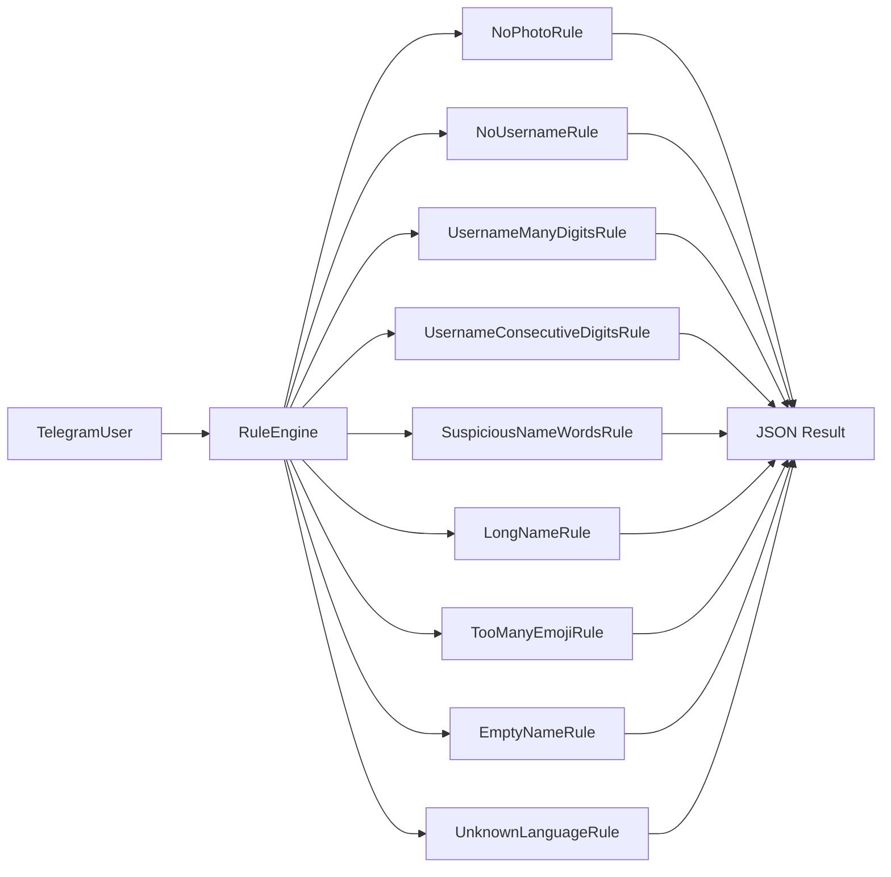

# BotHunter AI — Rule Engine

## Обзор

Rule Engine (v0.5+) оценивает профиль по набору детерминированных правил на основе **FeatureSet** (v0.7).

```
TelegramUser → FeatureExtractor → FeatureSet → RuleEngine → rule_score
```

---

## Архитектура



---

## BaseRule

Файл: `backend/app/rules/base.py`

| Метод | Назначение |
|-------|------------|
| `calculate(user)` | Возвращает score правила, если оно сработало, иначе `0` |
| `description()` | Текстовое описание правила |
| `weight()` | Максимальный вклад правила в score |

---

## Правила

| Класс | Условие | Score |
|-------|---------|------:|
| `NoPhotoRule` | `has_photo == False` | +20 |
| `NoUsernameRule` | username пустой | +10 |
| `UsernameManyDigitsRule` | > 6 цифр в username | +15 |
| `UsernameConsecutiveDigitsRule` | > 4 цифр подряд в username | +20 |
| `SuspiciousNameWordsRule` | имя содержит crypto/bonus/airdrop/casino/bet/forex/trade | +20 |
| `LongNameRule` | имя длиннее 30 символов | +10 |
| `TooManyEmojiRule` | >= 3 emoji в имени | +15 |
| `EmptyNameRule` | пустое имя (first + last) | +30 |
| `UnknownLanguageRule` | `language_code` пустой | +5 |

---

## Подсчёт score

1. `RuleEngine` последовательно применяет все правила.
2. Если `calculate(user) > 0`, правило попадает в `triggered_rules`.
3. `rule_score` = сумма `score` всех сработавших правил.

Правила независимы: несколько правил могут сработать одновременно.

---

## Пример JSON

```json
{
  "rule_score": 55,
  "triggered_rules": [
    {
      "rule": "NoPhotoRule",
      "score": 20
    },
    {
      "rule": "UsernameManyDigitsRule",
      "score": 15
    },
    {
      "rule": "UsernameConsecutiveDigitsRule",
      "score": 20
    }
  ]
}
```

Пример использования:

```python
from app.features import FeatureExtractor
from app.rules import RuleEngine

features = FeatureExtractor().extract(telegram_user)
result = RuleEngine().evaluate_as_json(features)
```

---

## Структура каталога

```
backend/app/rules/
├── __init__.py
├── base.py
├── definitions.py
└── engine.py
```

---

## Тестирование

```bash
cd backend
python -m pytest tests/rules/ -v
```

Покрытие:

- каждое правило отдельно;
- полный `RuleEngine`;
- граничные случаи (6 vs 7 цифр, 4 vs 5 подряд, 30 vs 31 символ).

---

## Ограничения v0.5

- OpenAI / AI **не используется**.
- Rule Engine **не принимает решение** (approve/reject).
- Join Request **не обрабатывается** на этом этапе.

Следующий этап: интеграция `rule_score` в pipeline анализа заявок.
