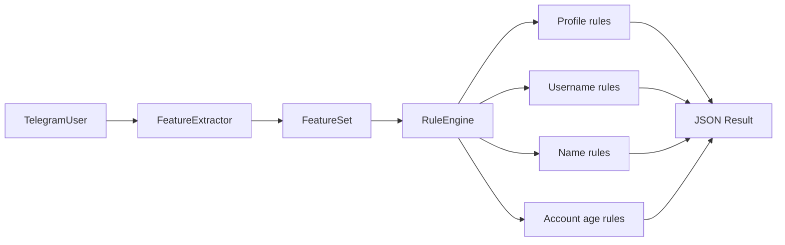

# BotHunter AI — Rule Engine

## Обзор

Rule Engine оценивает профиль по набору детерминированных правил на основе **FeatureSet**.

```
TelegramUser → FeatureExtractor → FeatureSet → RuleEngine → rule_score
```

Пороги решений и эвристики аккаунта — в `backend/config/decision_thresholds.yaml` (см. [join_request_processing.md](join_request_processing.md)).

---

## Архитектура



---

## BaseRule

Файл: `backend/app/rules/base.py`

| Метод | Назначение |
|-------|------------|
| `calculate(features)` | Возвращает score правила, если оно сработало, иначе `0` |
| `description()` | Текстовое описание правила |
| `weight()` | Максимальный вклад правила в score |

Веса и `enabled` настраиваются в **Policy Center** (`/admin/policies`) без изменения Python-кода.

---

## Правила (11)

| Класс | Условие | Score (default) |
|-------|---------|----------------:|
| `NoPhotoRule` | `has_photo == False` | +20 |
| `NoUsernameRule` | username пустой | +10 |
| `UsernameManyDigitsRule` | > 6 цифр в username | +15 |
| `UsernameConsecutiveDigitsRule` | > 4 цифр подряд в username | +20 |
| `SuspiciousNameWordsRule` | имя содержит crypto/bonus/airdrop/casino/bet/forex/trade | +20 |
| `LongNameRule` | имя длиннее 30 символов | +10 |
| `TooManyEmojiRule` | >= 3 emoji в имени | +15 |
| `EmptyNameRule` | пустое имя (first + last) | +30 |
| `UnknownLanguageRule` | `language_code` пустой | +5 |
| `AccountCreatedTodayRule` | оценка: аккаунт Telegram создан сегодня (User ID) | +35 |
| `NoLinkedPhoneRule` | эвристика: номер телефона не привязан | +15 |

### Account age & phone (v3.0.0)

Telegram Bot API **не отдаёт** дату регистрации и статус привязки телефона. BotHunter использует:

1. **Оценку даты регистрации** — линейная интерполяция по эталонным User ID (`app/features/telegram_account.py`).
2. **Эвристику телефона** — Premium и старые аккаунты считаются верифицированными; свежие non-Premium — вероятно без телефона.

Пороги в YAML:

```yaml
telegram_account_heuristics:
  no_phone_inference_max_age_days: 45
  linked_phone_assumed_min_age_days: 120
```

Серая зона (46–120 дней): `NoLinkedPhoneRule` не срабатывает.

---

## Подсчёт score

1. `RuleEngine` последовательно применяет все правила.
2. Если `calculate(features) > 0`, правило попадает в `triggered_rules`.
3. `rule_score` = сумма `score` всех сработавших правил.

Правила независимы: несколько правил могут сработать одновременно.

---

## Пример JSON

```json
{
  "rule_score": 50,
  "triggered_rules": [
    {"rule": "AccountCreatedTodayRule", "score": 35},
    {"rule": "NoLinkedPhoneRule", "score": 15}
  ]
}
```

Пример использования:

```python
from app.features import FeatureExtractor
from app.rules import RuleEngine

features = FeatureExtractor().extract(telegram_user)
result = RuleEngine().evaluate_as_json(features)
```

---

## Структура каталога

```
backend/app/rules/
├── __init__.py
├── base.py
├── definitions.py
└── engine.py
```

---

## Тестирование

```bash
cd backend
python -m pytest tests/rules/ tests/features/test_telegram_account.py -v
```

Покрытие:

- каждое правило отдельно;
- полный `RuleEngine`;
- граничные случаи (цифры в username, длина имени, account age heuristics).
